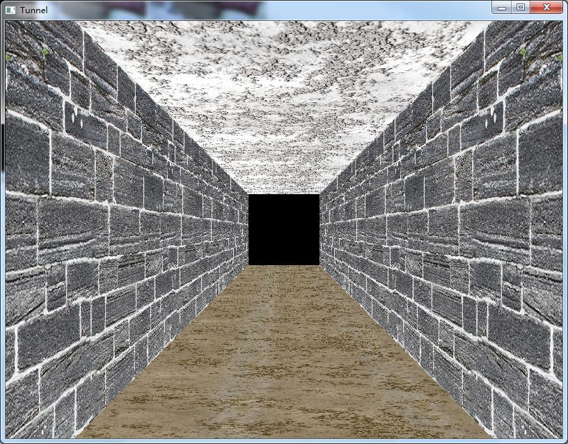
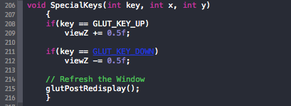

Tunnel
======
NOTICE: 你可以在[这里](https://github.com/Universefei/assignment/tree/master/computerGraphic)阅读此文档.

## Meta
* Name      : 费伦宙
* SchoolNo. : 1303121797

## Platform
* CPU : intel E6400
* OS  : Windows 7
* IDE : Visual Studio 2012


## File hierarchy
```
.
├── README.md
├── figure
│   └── 11png.png
└── src
    ├── Tunnel.cpp
    ├── brick.tga
    ├── ceiling.tga
    └── floor.tga

2 directories, 6 files
```


## Demo
运行效果如下图：


* 可以通过键盘的上下键来前进和后退。

